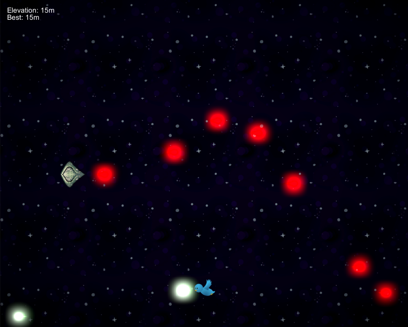

# Spacebirds

Short demo project showcasing basic proficiency with the Unity engine, shaders, and SOLID coding principles

- Features
	- Infinite gameplay with repeating background
	- Pooled enemy and bullet instancing
	- Basic sprite animations for bird
	- Basic canvas with current and high score
	- Extensible weapon and bullet classes
	- Used post-processing stack for HDR bloom
	- Vertex color bloom oscillation
	- Enemy dissolve shader effect
	- A bird that can fly very very high
